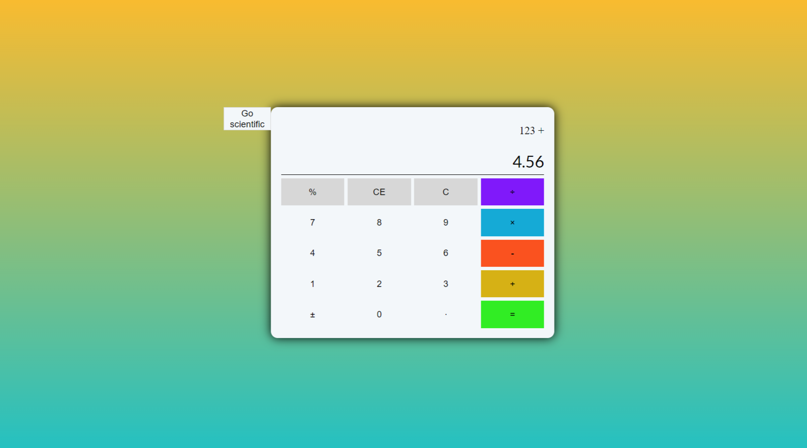
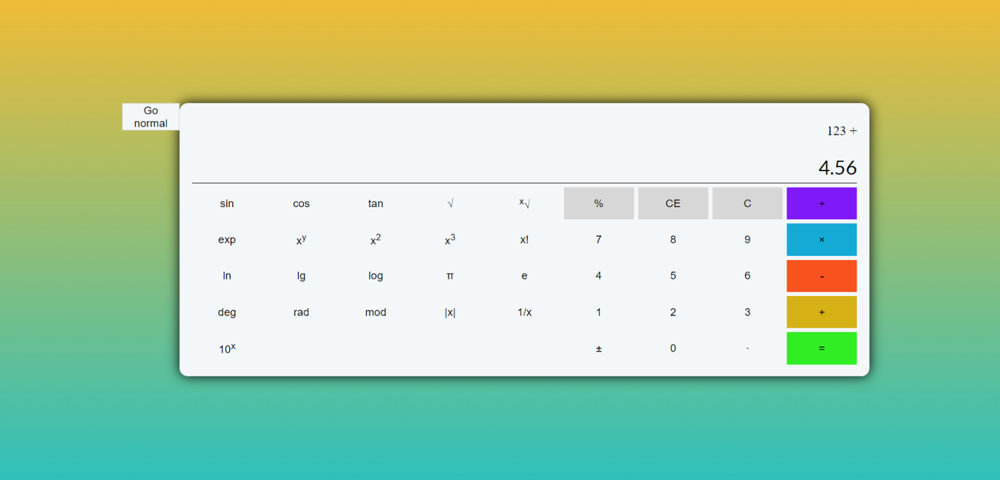

# calculatorJS
### Simple calculator web app made with vanilla JavaScript.

The project has finally reached its first release version of 1.0. Calculator has full key pad which is supported with actual keyboard inputs. Two outputs to display current number being worked with alongside the history panel. In addition program has two operating modes: normal and scientific in which much more functions become available: 

This simple calculator written with only vanilla JavaScript has over 30 unique functions.